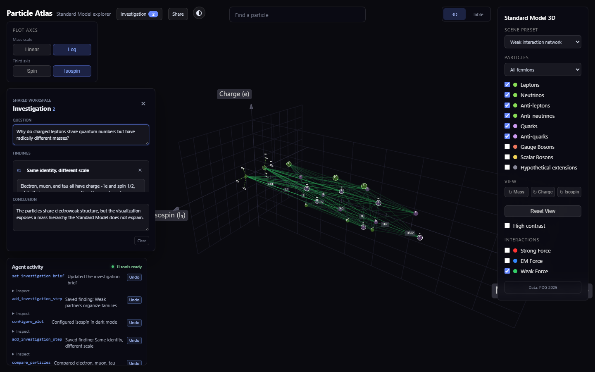

# Particle Atlas

**An agent-native Standard Model explorer for shared visual investigations.**

[Open Particle Atlas](https://yagyaanshk.github.io/standard_model/web/) | [Challenge implementation](CHALLENGE.md) | [Scientific sources](DATA_SOURCES.md)



Particle physics questions often begin in language but become understandable through relationships: mass hierarchies, shared quantum numbers, particle families, and force networks. Particle Atlas lets a person and a browser agent investigate those relationships in the same live Three.js workspace through WebMCP.

The agent does not operate a hidden copy of the application. It reads the same particle catalog, changes the visible scene, constructs comparisons, and saves replayable findings in a notebook the learner can edit and share.

## A shared investigation

Ask a WebMCP-enabled browser agent:

> Investigate why the electron, muon, and tau look identical in charge and spin but differ so much in mass. Build a logarithmic comparison, save the visual evidence as findings, then summarize the conclusion in the investigation notebook.

The agent can:

1. Query authoritative particle properties.
2. Configure the plot for the scientific question.
3. Compare or isolate the relevant particles.
4. Save the exact scene with a written finding.
5. Build a conclusion in the shared notebook.

The learner can rotate or filter the same scene, edit the agent's notes, undo agent actions, reopen any saved visual state, and share the complete investigation through one URL.

## Why WebMCP

Without WebMCP, an agent must infer controls from pixels and repeatedly manipulate a 3D interface. Particle Atlas instead exposes structured scientific and scene operations through `document.modelContext.registerTool()`.

This makes multi-step investigations faster, reproducible, inspectable, and reversible while preserving direct human control.

### WebMCP tools

| Tool | Purpose |
| --- | --- |
| `get_particle_catalog` | Query particle data by category, name, mass, or charge |
| `get_scene_state` | Inspect the current visual state |
| `focus_particle` | Focus the camera and open a particle record |
| `compare_particles` | Compare two to six particles in the shared scene |
| `configure_plot` | Set axes, presets, categories, theme, contrast, or representation |
| `show_force_network` | Display strong, electromagnetic, or weak interactions |
| `highlight_particles` | Highlight or isolate a particle set |
| `get_investigation` | Read the shared question, findings, and conclusion |
| `set_investigation_brief` | Frame or conclude the investigation |
| `add_investigation_step` | Save the current scene as a replayable finding |
| `reset_explorer` | Restore the default visual scene |

## Product features

- Four mass/charge/spin or isospin plot modes
- Curated views for lepton generations, quark families, matter/antimatter, force carriers, and weak interactions
- Human/agent comparison workspace for two to six particles
- Replayable, editable investigation notebook
- Inspectable agent history with full-scene undo
- Shareable URLs that restore scene, camera, comparisons, findings, and display settings
- PDG-linked masses, limits, uncertainty, and plotting-value semantics
- Keyboard navigation, high contrast, reduced motion, and complete table representation
- Responsive desktop and mobile controls
- Light and dark themes

## Run locally

The app uses browser ES modules and has no build step.

```bash
python -m http.server 8765 --directory web
```

Open `http://localhost:8765` in ChatGPT's in-app browser or Chrome with WebMCP enabled. In a regular browser, the complete manual explorer remains available.

## Test

```bash
python -m pip install -r requirements-test.txt
python -m playwright install chromium
python -m unittest discover -s tests -v
```

The end-to-end suite emulates the WebMCP host, registers and executes all eleven tools, and verifies structured results, notebook undo, scene replay, URL restoration, responsive layout, and manual fallback.

## Challenge work

Particle Atlas extends a pre-existing Standard Model visualization. The baseline is preserved at commit `1b71836df854f40117224b79856f1e012172e250`. WebMCP integration and the collaborative product experience were built after the challenge opened on August 25, 2026.

See [CHALLENGE.md](CHALLENGE.md) for the exact implementation boundary and commit evidence.

## Scientific scope

Particle masses and limits use Particle Data Group references documented in [DATA_SOURCES.md](DATA_SOURCES.md). Values used only to keep massless, constrained, or hypothetical entries visible are explicitly identified as plotting coordinates rather than measured masses.

The optional graviton entry is labeled hypothetical, separated from Standard Model particles, and hidden by default.

## Earlier visualizations

The repository also preserves the project's earlier Matplotlib and Manim experiments in `python_matplotlib_plots/` and `python_manim_plots/`. They document the path from static particle plots to the interactive, agent-native atlas.

## License

MIT. See [LICENSE](LICENSE).
